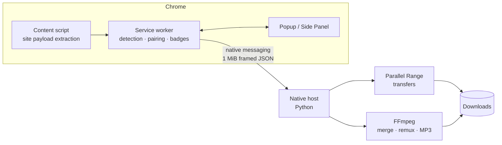

<div align="center">


# FluxCatch

**Keep What You See.**

A local-first Manifest V3 Chrome extension that detects the media a page is
playing and saves it cleanly — direct files, HLS and DASH streams, with an
optional macOS native engine for parallel, resumable downloads.

[](https://github.com/Blanchot-Alice/fluxcatch/releases)
[](https://developer.chrome.com/docs/extensions/develop/migrate)
[](LICENSE)
[](docs/INSTALL.md)
[](../../actions)

</div>

---

## What it does

FluxCatch passively watches what the current page actually requests and, on a
small allowlist of supported sites, can read media data already embedded in the
page. It uses no developer-operated service and lists the media resources it
can identify:
progressive MP4s, HLS master/variant playlists, MPEG-DASH manifests, and the
separate video/audio tracks used by modern players. Pick one, pick a quality,
and the file lands in your Downloads folder.

An optional native host (a small Python program running on your Mac) adds the
heavy machinery: parallel Range transfers, clear static-HLS VOD segment fetching,
stream-copy local post-processing via FFmpeg, and MP3 extraction. Live HLS,
encrypted HLS, discontinuities, and separate HLS audio tracks stay gated in
0.2.4 rather than being handed to an external tool for network access.
Everything stays on your machine.

| | |
| --- | --- |
| 🔍 **Passive by default** | Network detection rides on the page's own traffic. Supported-site quality metadata is requested only after you open FluxCatch, rescan, or explicitly enable automatic quality enrichment. |
| 📺 **Quality selection** | HLS variants and DASH representations are listed explicitly — including the Bilibili quality ladder your logged-in account can actually play. |
| ⚡ **Fast transfers** | The native engine splits downloads into concurrent ranges and merges with FFmpeg stream copy. |
| 🔒 **Local-first privacy** | No telemetry, no accounts, no cloud. Captured cookies remain scoped to the same origin that received them and are stripped when a redirect or manifest crosses origins. |
| 🛡️ **DRM stays DRM** | Protected content is detected and reported, never decrypted. |

## Site adapters

Generic detection covers most of the web. A few sites get first-class support
because their players need it:

| Site | Status | Notes |
| --- | --- | --- |
| **Bilibili video pages** | ✅ Stable | `/video/` pages: DASH video/audio pairing, opaque quality selectors, login-aware quality ladder, and short-lived signed URLs kept in memory only. Bangumi pages are not currently claimed as supported. |
| **Instagram** | ✅ Stable | Direct CDN links extracted from the page payload; private media downloads replay the page's own cookie only to the same CDN origin. |
| **X / Twitter** | ✅ Stable | `video_info` variants extracted in-page; best bitrate surfaced automatically. |
| **YouTube** | ⏸ Gated in 0.2.4 | The experimental adapter remains in GitHub source, but its candidate and download gates stay closed until yt-dlp can use the same pinned network broker as other transfers. |

## Interface

| Popup | Media workspace | Settings |
| --- | --- | --- |
|  |  |  |

The toolbar badge updates in real time as media is detected — no need to open
anything. The Side Panel is the persistent workbench for long downloads.

Opening the popup or Side Panel, clicking rescan, or enabling **自动补全站点画质**
may ask a supported site's own playback-metadata API for the qualities available
to the current login session. That setting is off by default. Automatic probes
never follow arbitrary URLs supplied by page markup.

## Quick start

**1. Load the extension**

Clone the repo, open `chrome://extensions`, enable **Developer mode**, click
**Load unpacked**, and select `extension/`.

**2. (macOS, recommended) Install the native engine**

```bash
./native-host/install-macos.sh
```

This registers the native host for Chrome, Chrome for Testing and Chromium,
pins stable Homebrew paths, and detects FFmpeg. Ordinary single-file downloads
work without it; accelerated and stream downloads need it.

**3. Use it**

Open a page that's playing media, watch the toolbar badge light up, click the
FluxCatch icon, and download.

<details>
<summary>YouTube status in 0.2.4</summary>

The GitHub source retains the experimental adapter, but its setting, candidate,
and download gates stay closed in 0.2.4. Installing yt-dlp alone does not enable
downloads. The adapter returns only after external tools can use FluxCatch's
pinned network broker.

</details>

## Architecture



The extension never holds more than it needs: signed Bilibili track URLs live
in service-worker memory for at most two minutes, session storage receives
redacted metadata only, and the native host gets the exact headers and URL for
the task you started — nothing else. See [Privacy](PRIVACY.md) for the full
data-flow statement and [Architecture](docs/ARCHITECTURE.md) for the deep dive.

FluxCatch-owned active fetches default to public targets. The native engine pins
authorized peers and rechecks redirects and manifest children; local/private
media requires explicit opt-in, while metadata and reserved ranges stay blocked.
Ordinary Chrome-backed direct downloads are limited to URLs whose final media
response the browser already observed, and Chrome owns that transfer lifecycle.

## Development

```bash
npm test                                  # extension unit + UI static tests
python3 -m unittest discover -s native-host/tests -v
python3 scripts/validate.py               # manifest + syntax validation
npm run test:e2e                          # Chrome for Testing detection suite
npm run package                           # dist/ zips + SHA256SUMS
```

## Documentation

- [Installation guide](docs/INSTALL.md) — native host details, store vs. unpacked
- [Architecture](docs/ARCHITECTURE.md) — detection, pairing, session model
- [Release readiness](docs/RELEASE.md) and the [Chrome Web Store checklist](docs/CHROME_WEB_STORE_CHECKLIST.zh-CN.md)
- [Privacy policy](PRIVACY.md) · [Security policy](SECURITY.md) · [Acceptable use](ACCEPTABLE_USE.md)
- [Detection E2E suite](e2e/README.md) — what the automated browser tests prove (and don't)

## License

[MIT](LICENSE) — FluxCatch is intended for media you own or are permitted to
save. It does not decrypt DRM content or bypass access controls.
