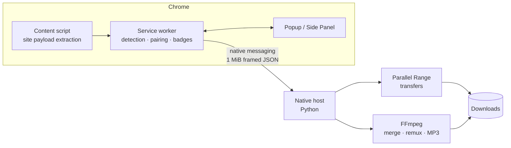

<div align="center">


# FluxCatch

**Keep What You See.**

A local-first Manifest V3 Chrome extension that detects the media a page is
playing and saves it cleanly — direct files, HLS and DASH streams, with an
optional macOS native engine for parallel, resumable downloads.

[](https://github.com/Blanchot-Alice/fluxcatch/releases)
[](https://developer.chrome.com/docs/extensions/develop/migrate)
[](LICENSE)
[](docs/INSTALL.md)
[](../../actions)

</div>

---

## What it does

FluxCatch watches what the current page actually requests — no scraping, no
third-party services — and lists every media resource it can identify:
progressive MP4s, HLS master/variant playlists, MPEG-DASH manifests, and the
separate video/audio tracks used by modern players. Pick one, pick a quality,
and the file lands in your Downloads folder.

A optional native host (a small Python program running on your Mac) adds the
heavy machinery: parallel Range transfers, HLS segment fetching, stream-copy
merging via FFmpeg, and MP3 extraction. Everything stays on your machine.

| | |
| --- | --- |
| 🔍 **Passive detection** | Nothing is requested until you open the popup; detection rides on the page's own traffic. |
| 📺 **Quality selection** | HLS variants and DASH representations are listed explicitly — including the Bilibili quality ladder your logged-in account can actually play. |
| ⚡ **Fast transfers** | The native engine splits downloads into concurrent ranges and merges with FFmpeg stream copy. |
| 🔒 **Local-first privacy** | No telemetry, no accounts, no cloud. Cookies captured for a download only ever travel to the exact CDN URL that received them. |
| 🛡️ **DRM stays DRM** | Protected content is detected and reported, never decrypted. |

## Site adapters

Generic detection covers most of the web. A few sites get first-class support
because their players need it:

| Site | Status | Notes |
| --- | --- | --- |
| **Bilibili** | ✅ Stable | DASH video/audio pairing, opaque quality selectors, login-aware quality ladder (4K with 大会员), short-lived signed URLs kept in memory only. |
| **Instagram** | ✅ Stable | Direct CDN links extracted from the page payload; private media downloads replay the page's own cookie to the same CDN URL. |
| **X / Twitter** | ✅ Stable | `video_info` variants extracted in-page; best bitrate surfaced automatically. |
| **YouTube** | 🧪 Experimental | Off by default. When enabled, the watch URL is handed to your locally installed [yt-dlp](https://github.com/yt-dlp/yt-dlp) — no YouTube URLs or credentials flow anywhere else. |

## Interface

| Popup | Media workspace | Settings |
| --- | --- | --- |
|  |  |  |

The toolbar badge updates in real time as media is detected — no need to open
anything. The Side Panel is the persistent workbench for long downloads.

## Quick start

**1. Load the extension**

Clone the repo, open `chrome://extensions`, enable **Developer mode**, click
**Load unpacked**, and select `extension/`.

**2. (macOS, recommended) Install the native engine**

```bash
./native-host/install-macos.sh
```

This registers the native host for Chrome, Chrome for Testing and Chromium,
pins stable Homebrew paths, and detects FFmpeg. Ordinary single-file downloads
work without it; accelerated and stream downloads need it.

**3. Use it**

Open a page that's playing media, watch the toolbar badge light up, click the
FluxCatch icon, and download.

<details>
<summary>Want YouTube downloads too?</summary>

Install yt-dlp (`brew install yt-dlp`), then open FluxCatch settings →
**站点适配器（实验性）** → enable the YouTube toggle. YouTube candidates only
appear while the toggle is on, and quality is whatever your local yt-dlp
resolves.

</details>

## Architecture



The extension never holds more than it needs: signed Bilibili track URLs live
in service-worker memory for at most two minutes, session storage receives
redacted metadata only, and the native host gets the exact headers and URL for
the task you started — nothing else. See [Privacy](PRIVACY.md) for the full
data-flow statement and [Architecture](docs/ARCHITECTURE.md) for the deep dive.

## Development

```bash
npm test                                  # extension unit + UI static tests
python3 -m unittest discover -s native-host/tests -v
python3 scripts/validate.py               # manifest + syntax validation
npm run test:e2e                          # Chrome for Testing detection suite
npm run package                           # dist/ zips + SHA256SUMS
```

## Documentation

- [Installation guide](docs/INSTALL.md) — native host details, store vs. unpacked
- [Architecture](docs/ARCHITECTURE.md) — detection, pairing, session model
- [Release readiness](docs/RELEASE.md) and the [Chrome Web Store checklist](docs/CHROME_WEB_STORE_CHECKLIST.zh-CN.md)
- [Privacy policy](PRIVACY.md) · [Security policy](SECURITY.md) · [Acceptable use](ACCEPTABLE_USE.md)
- [Detection E2E suite](e2e/README.md) — what the automated browser tests prove (and don't)

## License

[MIT](LICENSE) — FluxCatch is intended for media you own or are permitted to
save. It does not decrypt DRM content or bypass access controls.
