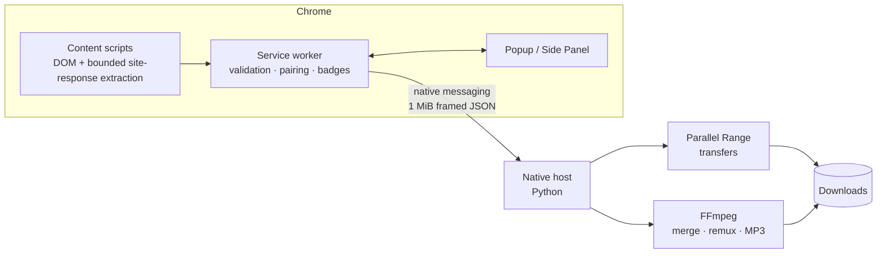

<div align="center">


# FluxCatch

**Keep What You See.**

A local-first Manifest V3 Chrome extension that detects the media a page is
playing — direct files, HLS and DASH streams. Detection works without a local
helper; saving most detected resources uses the separately installed macOS
native engine for policy-controlled, resumable downloads.

[](https://github.com/Blanchot-Alice/fluxcatch/releases)
[](https://developer.chrome.com/docs/extensions/develop/migrate)
[](LICENSE)
[](docs/INSTALL.md)
[](../../actions)

</div>

---

## What it does

FluxCatch passively watches what the current page actually requests and, on a
small allowlist of supported sites, can read media data already embedded in the
page. It uses no developer-operated service and lists the media resources it
can identify:
progressive MP4s, HLS master/variant playlists, MPEG-DASH manifests, and the
separate video/audio tracks used by modern players. Pick one and pick a quality;
when the selected save path requires the local engine, FluxCatch asks before
requesting its optional Chrome permission.

The separately installed native host (a small Python program running on your
Mac) is not needed for detection, but is required for most downloads. It owns
the policy-controlled transfer path, parallel Range transfers, clear static-HLS
VOD segment fetching, local merging of separate HLS video/audio renditions,
stream-copy local post-processing via FFmpeg, and MP3 extraction. Only narrowly
allowlisted complete Instagram/X MP4s may remain in Chrome's download path;
enabling **可信直链也使用本地下载引擎** sends even those exceptions through
the native engine instead.
Live HLS, encrypted HLS, and discontinuities stay gated rather than being handed
to an external tool for network access.
FluxCatch has no developer-operated telemetry, relay, or cloud-processing
service. Detection state and post-processing remain on the device; an explicit
inspect, metadata-enrichment, or download action still contacts the selected
source service.

| | |
| --- | --- |
| 🔍 **Passive detection** | Network detection rides on the page's own traffic. Default-on supported-site quality enrichment may call fixed page-list/playback metadata APIs after a trusted playback/preload request; it is rate-limited and can be disabled completely. Page completion and merely opening FluxCatch stay read-only. |
| 📺 **Quality selection** | HLS variants and DASH representations are listed explicitly — including the Bilibili quality ladder your logged-in account can actually play. |
| ⚡ **Conditional acceleration** | When the source server supports byte ranges and the native path is enabled, FluxCatch can download multiple ranges concurrently. This does not guarantee higher throughput. |
| 🔒 **Local-first privacy** | No developer telemetry, account, relay, or cloud-processing service. Captured cookies remain scoped to the same origin that received them and are stripped when a native redirect or manifest child crosses origins. |
| 🛡️ **DRM stays DRM** | Protected content is detected and reported, never decrypted. |

## Site adapters

Generic detection handles many conventional media requests, but compatibility
varies by player, manifest structure, server behavior, and access policy. A few
sites get first-class support because their players need it:

| Site | Status | Notes |
| --- | --- | --- |
| **Bilibili video pages** | 🧪 Adapter beta | `/video/` pages: DASH video/audio pairing, opaque quality selectors, login-aware quality ladder, and short-lived signed URLs kept in memory only. Unit/native fixtures cover the boundary; a release-quality browser adapter matrix is still required. Bangumi pages are not claimed as supported. |
| **Instagram** | 🧪 Adapter beta | Bounded unit fixtures select the best complete MP4 from page/SPA payloads and suppress query-addressed playback fragments. Browser-level SPA, worker-restart, and download coverage remains a release gate. |
| **X / Twitter** | 🧪 Adapter beta | Bounded unit fixtures prefer the highest-bitrate progressive `video_info` MP4 over HLS. Browser-level SPA, worker-restart, and download coverage remains a release gate. |
| **YouTube** | ⏸ Source-only in 0.2.5 | Experimental source remains in the repository, but the stable profile renders no YouTube or yt-dlp controls, publishes no YouTube candidates, and never launches yt-dlp for network access. |

## Interface

The toolbar badge updates in real time as media is detected. The compact popup
handles selection and download settings, the Side Panel is the persistent
workbench for long downloads, and Settings groups the build identity,
day-to-day download controls, privacy boundaries, and local capabilities in a
single reading flow. Installed tools, connected services, protocol
compatibility, and capabilities enabled by the current build are reported as
separate states; installing a tool does not silently enable a gated feature.


| Popup | Side Panel | Download dialog |
| --- | --- | --- |
|  |  |  |

Settings uses a normalized saved baseline: the save bar remains inactive until
a value actually changes, validates fields before writing, and keeps unsaved
state after a failed save. Private-network access requires an additional
confirmation, while optional notification and Native Messaging permissions are
requested from the control the user activated. Popup and Side Panel actions
show local pending, success, or failure feedback and suppress duplicate clicks.

All three surfaces share packaged design tokens and control primitives while
keeping page-specific layouts in plain HTML, CSS, and JavaScript. They support
keyboard operation, visible focus, system dark mode, narrow widths, and
`prefers-reduced-motion`. The stable GitHub profile does not actively fetch
page-derived remote thumbnails; media cards use packaged type tiles instead.

**自动补全站点画质** is on by default. On a supported Bilibili `/video/` page,
a trusted media request (which may result from playback or player preload) may
start calls to the fixed `api.bilibili.com` page-list and playback-metadata
endpoints—with same-site cookies—for the qualities available to the current
login session. Repeated requests are coalesced and cooldown-limited.
Turning the setting off blocks every automatic metadata call; **重新扫描**
remains available. Page completion and merely opening FluxCatch stay read-only,
and page markup cannot select an arbitrary endpoint.

## Quick start

**1. Load the extension**

Clone the repo, open `chrome://extensions`, enable **Developer mode**, click
**Load unpacked**, and select `extension/`.

**2. (macOS, required for most downloads) Install the native engine**

```bash
./scripts/native-install-wrapper.sh
```

The wrapper verifies Python 3.9+ before registering the native host for Chrome
and installed Chromium-family development browsers. It pins stable Homebrew
paths and detects FFmpeg. If you downloaded the separate native-host ZIP, extract
the whole archive and run `./install-macos.sh` from its root instead. Detection
and preview remain available without the host, but most save actions, stream
downloads, merging, conversion, and acceleration need it. Chrome saving without
the host is limited to the fixed, provenance-checked Instagram/X MP4 allowlist,
unless **可信直链也使用本地下载引擎** is enabled.

**3. Use it**

Open a page that's playing media, watch the toolbar badge light up, click the
FluxCatch icon, and download.

<details>
<summary>YouTube status in 0.2.5</summary>

Experimental YouTube-related source remains in the repository, but the stable
0.2.5 profile exposes no YouTube or yt-dlp controls, candidates, or download
path. Installing yt-dlp does not enable the feature.

</details>

## Architecture



The extension never holds more than it needs: signed Bilibili track URLs live
in service-worker memory for at most two minutes, session storage receives
redacted metadata only, and extension pages receive a non-executable
`displayUrl` plus an opaque `{id, kind, generation}` reference. The service
worker resolves that reference back to the current private target when you
start a task. See [Privacy](PRIVACY.md) for the full data-flow statement and
[Architecture](docs/ARCHITECTURE.md) for the deep dive.

Extension-owned probes validate URL syntax, literal host/IP category, purpose,
provenance, and worker-derived origin allowlists; browser fetch APIs do not
expose DNS answers or connected peers. Native transfers additionally validate
DNS answers, pin the authorized peer, recheck redirects and manifest children,
and remove sensitive headers monotonically on cross-origin transitions.
Local/private media requires explicit opt-in, while metadata and reserved ranges
stay blocked. Even a generic final media response observed by Chrome is
transferred through the native policy broker. Chrome-backed saving is limited to
strictly allowlisted complete Instagram/X MP4 metadata from the corresponding
top-level site; Chrome owns only that narrow transfer lifecycle. The
**可信直链也使用本地下载引擎** setting opts those exceptions back into the
native broker. Chrome's save-location prompt applies only while that Chrome
exception is actually selected.

## Development

```bash
npm test                                  # extension unit + UI static tests
npm run test:coverage                     # 65% lines/branches, 70% functions minimum
python3 -m unittest discover -s native-host/tests -v
python3 scripts/validate.py               # manifest + syntax validation
npm run test:e2e                          # Chrome detection, UI and interaction suite
npm run package                           # dist/ zips + SHA256SUMS
npm run verify:package                    # checksums, source identity, safe ZIP metadata and bundle links
```

The browser suite uses deterministic local fixtures. The 0.2.5 release gate
requires UI evidence for Settings, popup, Side Panel, the download dialog,
light/dark and narrow layouts, form states, and reduced motion in addition to
the existing detection and download flows. Runtime screenshots and the
machine-readable report are written under `e2e/artifacts/`; they are evidence
for the tested checkout, not claims about a live public website.

CI builds the release archives once, retains those exact bytes as a workflow
artifact, and runs Chrome E2E against the unpacked extension ZIP rather than a
second source build. Package timestamps and modes derive from
`SOURCE_DATE_EPOCH` or the candidate commit time, so repeated builds of the same
tree are byte-for-byte reproducible. A dirty diagnostic package uses a canonical
digest of the complete extension tree and never qualifies as a release artifact.

## Documentation

- [Installation guide](docs/INSTALL.md) — native host details, store vs. unpacked
- [Architecture](docs/ARCHITECTURE.md) — detection, pairing, session model
- [Release readiness](docs/RELEASE.md) and the [Chrome Web Store checklist](docs/CHROME_WEB_STORE_CHECKLIST.zh-CN.md)
- [Privacy policy](PRIVACY.md) · [Security policy](SECURITY.md) · [Acceptable use](ACCEPTABLE_USE.md)
- [Detection E2E suite](e2e/README.md) — what the automated browser tests prove (and don't)

## License

[MIT](LICENSE) — FluxCatch is intended for media you own or are permitted to
save. It does not decrypt DRM content or bypass access controls.
