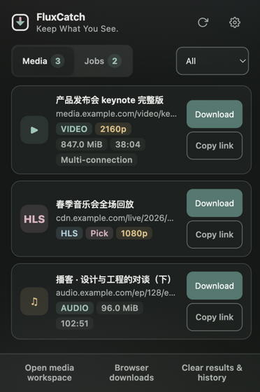
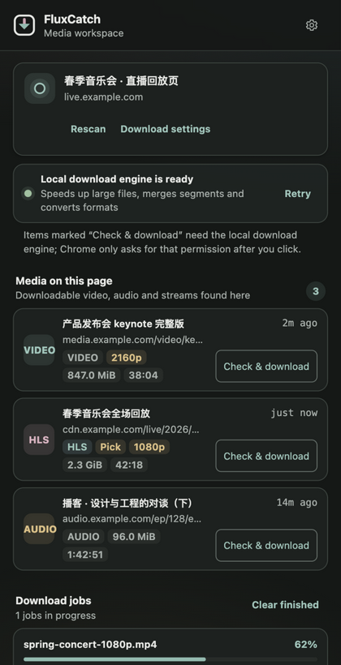
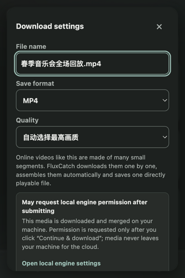
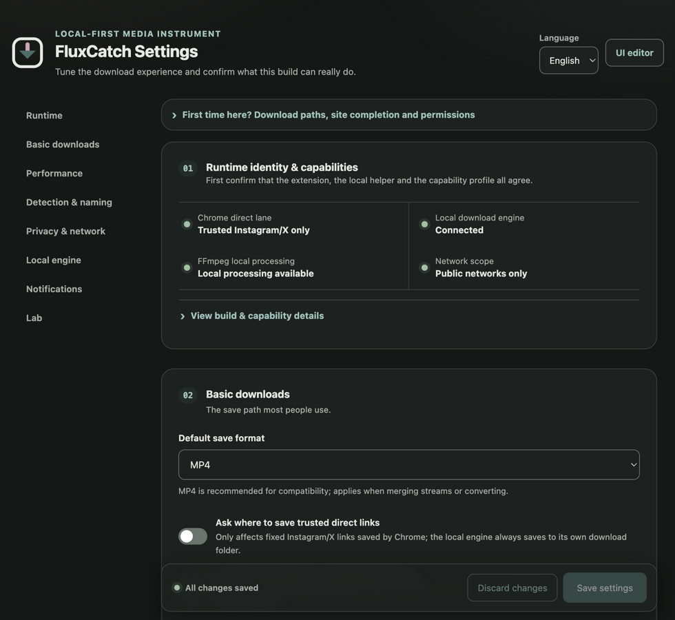
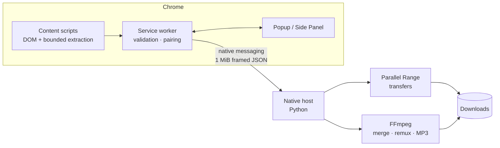

<div align="center">


# FluxCatch

**Keep What You See.**

*Local-first media detection & acquisition for macOS + Chrome*

A passive Manifest V3 extension that watches what the page itself requests —
direct files, HLS, DASH — and saves through a policy-controlled local engine.
No cloud. No relay. Your bytes never leave your machine except toward the site
you are already visiting.

[](https://github.com/Blanchot-Alice/fluxcatch/releases)
[](https://developer.chrome.com/docs/extensions/develop/migrate)
[](LICENSE)
[](docs/INSTALL.md)
[](../../actions)

**English** · [简体中文](README.zh-CN.md)

</div>

---

## Why FluxCatch

Browser download helpers usually fall into two camps: cloud services that see
every byte you fetch, or page-injecting scrapers that fight every site redesign.
FluxCatch is a third path — **a transparent, local-first media inspector and
acquisition engine**. It only reports what the browser itself already received,
explains every boundary in plain language, and refuses closed doors instead of
picking them.

| | |
| --- | --- |
| 🔍 **Passive detection** | Rides on the page's own traffic. Optional quality enrichment is rate-limited, single-site, and one switch away from off. |
| 📺 **Honest quality ladder** | HLS variants and DASH representations listed explicitly — including the Bilibili ladder your logged-in account can actually play. |
| 🎚 **Grouped renditions** | Sites that never expose a master playlist still get one card with a resolution dropdown; video + audio merge losslessly via FFmpeg. |
| ⚡ **Conditional acceleration** | Parallel Range transfers when the server supports them; claimed honestly, guaranteed by nothing. |
| 🔒 **Local-first privacy** | No telemetry, account, or relay. Cookies stay scoped to their origin and are stripped on cross-origin hops. |
| 🛡️ **DRM stays DRM** | Protected content is detected and reported — never decrypted, never bypassed. |

## Site adapters

Generic detection covers many conventional requests. A few players need
first-class treatment:

| Site | Status | Notes |
| --- | --- | --- |
| **Bilibili** `/video/` | 🧪 beta | DASH pairing, opaque quality selectors, login-aware ladder, signed URLs kept in memory only. Bangumi not claimed. |
| **Instagram** | 🧪 beta | Best complete MP4 from page/SPA payloads; playback fragments suppressed. |
| **X / Twitter** | 🧪 beta | Highest-bitrate progressive `video_info` MP4 preferred over HLS. |
| **YouTube** | ⏸ source-only | Experimental code exists; the stable profile exposes no YouTube path and never launches yt-dlp. |

## Interface

The toolbar badge lights up as media is detected. The popup handles quick
saves, the Side Panel is the long-download workbench, Settings explains build
identity, privacy boundaries and local capabilities in one honest reading flow.

| Popup | Side Panel | Download dialog |
| :---: | :---: | :---: |
|  |  |  |

<p align="center"></p>

All three surfaces share packaged design tokens with keyboard operation,
visible focus, dark mode, narrow widths, and `prefers-reduced-motion`.

## Quick start

**1 · Load the extension**

```bash
git clone https://github.com/Blanchot-Alice/fluxcatch.git
```

Open `chrome://extensions` → enable **Developer mode** → **Load unpacked** →
select `extension/`.

**2 · Install the native engine** *(macOS, required for most downloads)*

```bash
./scripts/native-install-wrapper.sh
```

Pins stable Homebrew paths, verifies Python 3.9+, detects FFmpeg. Or grab the
ready-made [`v0.2.5` packages](https://github.com/Blanchot-Alice/fluxcatch/releases/tag/v0.2.5):
unzip the native bundle whole and run `./install-macos.sh`.

**3 · Use it**

Play something. Watch the badge. Click. Download.

> Detection works without the engine. Most saves, merging, conversion and
> acceleration need it — Chrome-only saving is limited to the narrowly
> allowlisted Instagram/X MP4 set.

<details>
<summary><strong>Development</strong></summary>

```bash
npm test                                  # extension unit + UI static tests
npm run test:coverage                     # 65% lines/branches, 70% functions minimum
python3 -m unittest discover -s native-host/tests -v
python3 scripts/validate.py               # manifest + syntax validation
npm run test:e2e                          # Chrome detection, UI and interaction suite
npm run package                           # dist/ zips + SHA256SUMS
npm run verify:package                    # checksums, identity, safe ZIP metadata
```

CI builds release archives once, retains those exact bytes, and runs Chrome E2E
against that ZIP. Builds are byte-for-byte reproducible from
`SOURCE_DATE_EPOCH` or the commit time.

</details>

## How it fits together



Extension probes validate URL syntax, host category, purpose, provenance and
origin allowlists. Native transfers additionally pin connected peers, re-check
redirects and manifest children, and strip sensitive headers monotonically on
cross-origin transitions. Signed URLs live in service-worker memory for at most
two minutes; UI surfaces receive redacted metadata plus opaque references only.

Deep dives: [Architecture](docs/ARCHITECTURE.md) · [Privacy](PRIVACY.md) ·
[Security](SECURITY.md) · [Release readiness](docs/RELEASE.md)

## License

[MIT](LICENSE) — FluxCatch is intended for media you own or are permitted to
save. It does not decrypt DRM content or bypass access controls.
