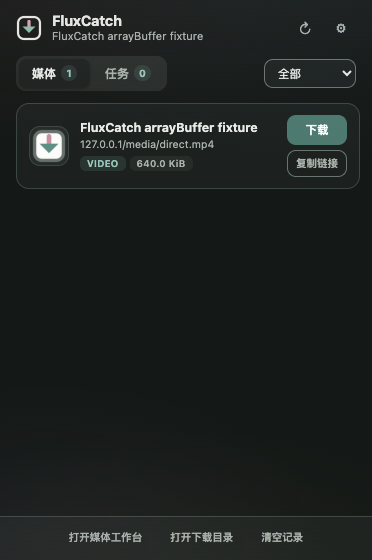
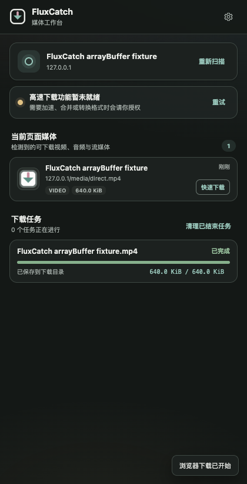
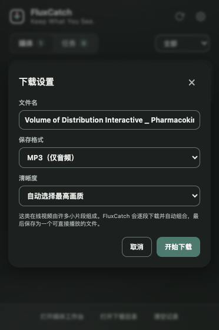
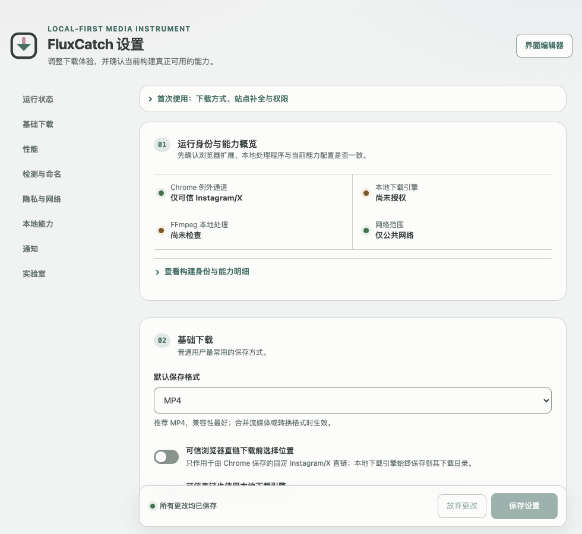
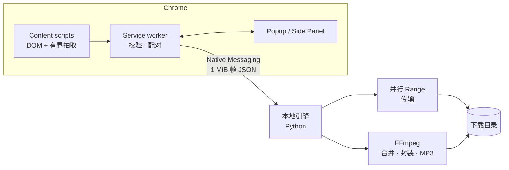

<div align="center">


# FluxCatch

**所见，即所得。**

*本地优先的媒体检测与获取引擎 · macOS + Chrome*

一款基于 Manifest V3 的静默观察者。

顺着页面自身的呼吸，捕获自然流淌的直链、HLS 与 DASH；借由策略受控的本地引擎，将流动的光影沉淀为确定的实体。

无云端驻留，无中继介入。除却你目光停留的原点，你的字节不渡他方。

[](https://github.com/Blanchot-Alice/fluxcatch/releases)
[](https://developer.chrome.com/docs/extensions/develop/migrate)
[](LICENSE)
[](docs/INSTALL.md)
[](../../actions)

[English](README.md) · **简体中文**

</div>

---

## 为什么是 FluxCatch

浏览器下载工具通常只有两条路：把每一个字节都交给云服务的“云端帮手”，或者
靠注入页面与每个网站改版缠斗的爬虫。FluxCatch 走第三条路——
**一台透明、本地优先的媒体检查与获取引擎**：只报告浏览器已经收到的内容，
用平实的语言说明每一条边界；门关着就是关着，绝不撬锁。

| | |
| --- | --- |
| 🔍 **被动检测** | 只随页面自身的流量而行。可选的画质增强有速率限制、仅限单一站点、一键即关。 |
| 📺 **诚实的画质阶梯** | HLS 变体与 DASH 分辨率逐条列出——包括你登录账号在 B 站实际可播的那一档。 |
| 🎚 **变体聚组** | 站点从不暴露 master playlist 也能聚成一张卡 + 清晰度下拉；音视频经 FFmpeg 无损合并。 |
| ⚡ **有条件加速** | 服务器支持 Range 才并行下载；能力照实说，不打包票。 |
| 🔒 **本地优先隐私** | 无遥测、无账号、无中转。Cookie 锁定在原站范围内，跨域跳转即被剥离。 |
| 🛡️ **DRM 就是 DRM** | 受保护内容只做检测与提示——不解密、不绕过。 |

## 站点适配

通用检测覆盖多数常规请求，少数播放器需要专门对待：

| 站点 | 状态 | 说明 |
| --- | --- | --- |
| **Bilibili** `/video/` | 🧪 内测 | DASH 音视频配对、不透明清晰度选择器、登录感知的画质阶梯、签名链接仅存内存。番剧页不在支持声明内。 |
| **Instagram** | 🧪 内测 | 从页面/SPA 数据中选出最佳完整 MP4；播放分片自动抑制。 |
| **X / Twitter** | 🧪 内测 | 优先最高码率的 `video_info` 渐进式 MP4，而非 HLS。 |
| **YouTube** | ⏸ 仅源码 | 实验代码保留在仓库中；稳定版不暴露任何 YouTube 通道，也绝不启动 yt-dlp。 |

## 界面

媒体一经检出，工具栏角标即时点亮。Popup 负责快速保存，Side Panel 是长任务
工作台，设置页把构建身份、隐私边界和本机能力放进同一段诚实的阅读流。

| Popup | Side Panel | 下载对话框 |
| :---: | :---: | :---: |
|  |  |  |

<p align="center"></p>

三个界面共享同一套设计令牌，支持键盘操作、可见焦点、深色模式、窄窗口与
`prefers-reduced-motion`。

## 快速开始

**一 · 加载扩展**

```bash
git clone https://github.com/Blanchot-Alice/fluxcatch.git
```

打开 `chrome://extensions` → 开启 **开发者模式** → **加载已解压的扩展程序**
→ 选择 `extension/` 目录。

**二 · 安装本地引擎** *（macOS，多数下载必需）*

```bash
./scripts/native-install-wrapper.sh
```

脚本会固定 Homebrew 稳定路径、校验 Python 3.9+ 并探测 FFmpeg。也可以直接取用
[`v0.2.5` 现成包](https://github.com/Blanchot-Alice/fluxcatch/releases/tag/v0.2.5)：
native 压缩包请整体解压后在根目录执行 `./install-macos.sh`。

**三 · 使用**

打开在放视频的页面 → 角标亮起 → 点击图标 → 下载。

> 不装引擎也能检测和预览。多数保存、合并、转码与加速需要引擎——不走引擎的
> Chrome 直接保存仅限白名单内的 Instagram/X 完整 MP4。

<details>
<summary><strong>开发</strong></summary>

```bash
npm test                                  # 扩展单测 + UI 静态测试
npm run test:coverage                     # 行/分支 ≥65%，函数 ≥70%
python3 -m unittest discover -s native-host/tests -v
python3 scripts/validate.py               # manifest 与语法校验
npm run test:e2e                          # Chrome 检测 / UI / 交互套件
npm run package                           # dist/ 双包 + SHA256SUMS
npm run verify:package                    # 校验和、构建身份、ZIP 安全元数据
```

CI 只构建一次发布归档并原样保留这些字节，E2E 跑在这份 ZIP 上。从
`SOURCE_DATE_EPOCH` 或提交时间出发，同样的树得到逐字节一致的产物。

</details>

## 架构总览



扩展侧探针校验 URL 语法、主机类别、用途、来源与 origin 白名单；本地引擎进一步
钉住对端、复核重定向与清单子资源，并在跨域跳转时单调剥离敏感头。签名链接至多
在 service worker 内存里存活两分钟；界面只会收到脱敏元数据和不透明引用。

深入阅读：[架构文档](docs/ARCHITECTURE.md) · [隐私政策](PRIVACY.md) ·
[安全策略](SECURITY.md) · [发布就绪](docs/RELEASE.md)

## 许可证

[MIT](LICENSE) — FluxCatch 用于保存你拥有或被许可保存的媒体，不解密 DRM
内容，也不绕过访问控制。
